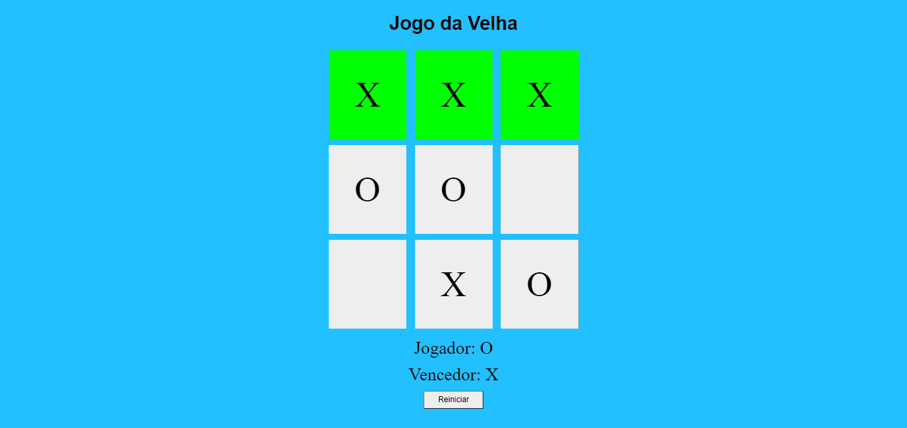

# Jogo-da-velha-com-HTML-CSS-JS
### Jogo da velha criado com HTML, CSS e JS como forma de aprendizado. Exercício tirado do site [Digital Innovation One](https://digitalinnovation.one/)
### Para ver o projeto [clique aqui](https://felipeferreirass.github.io/Jogo-da-velha-com-HTML-CSS-JS/)

